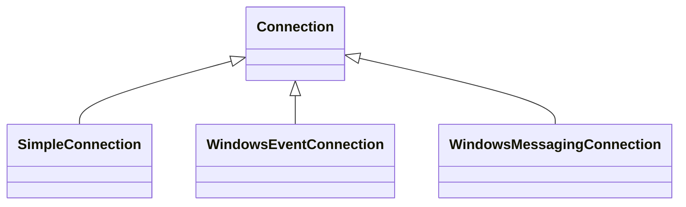
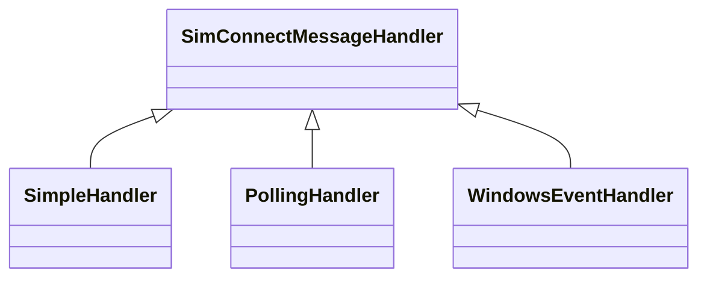
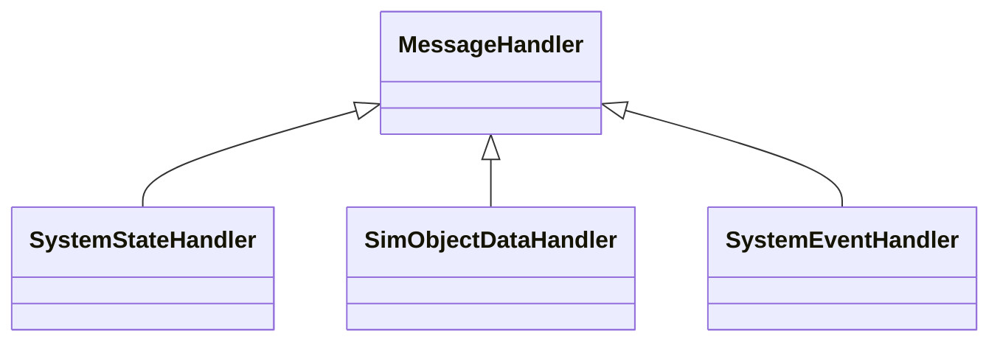
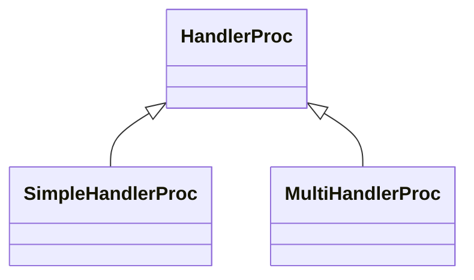
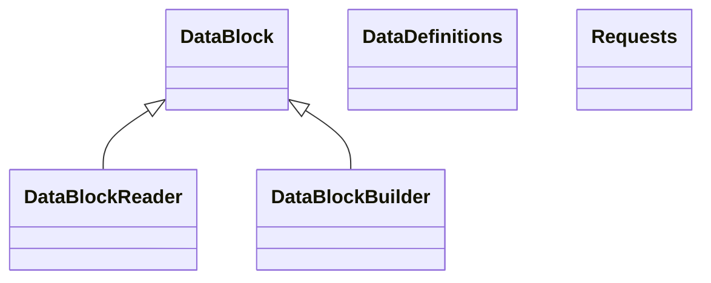
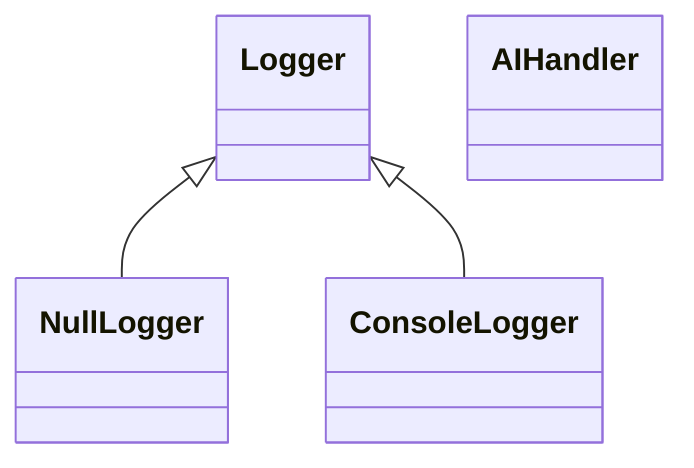

# Library overview
## Architecture

The following class diagram shows the main classes in `include/simconnect/` and their inheritance relationships (no fields shown).

```mermaid
classDiagram
	%% Core connections and handlers
	class Connection
	class SimpleConnection
	class WindowsEventConnection
	class WindowsMessagingConnection

	Connection <|-- SimpleConnection
	Connection <|-- WindowsEventConnection
	Connection <|-- WindowsMessagingConnection

```

```mermaid
classDiagram

	%% Message handler base and specializations
	class SimConnectMessageHandler
	class SimpleHandler
	class PollingHandler
	class WindowsEventHandler

	SimConnectMessageHandler <|-- SimpleHandler
	SimConnectMessageHandler <|-- PollingHandler
	SimConnectMessageHandler <|-- WindowsEventHandler

```

```mermaid
classDiagram

	%% MessageHandler (correlation-based CRTP)
	class MessageHandler
	class SystemStateHandler
	class SimObjectDataHandler
	class SystemEventHandler

	MessageHandler <|-- SystemStateHandler
	MessageHandler <|-- SimObjectDataHandler
	MessageHandler <|-- SystemEventHandler


```

```mermaid
classDiagram

	%% Messaging utilities
	class HandlerProc
	class SimpleHandlerProc
	class MultiHandlerProc

	HandlerProc <|-- SimpleHandlerProc
	HandlerProc <|-- MultiHandlerProc

```

```mermaid
classDiagram

	%% Data blocks and builders
	class DataBlock
	class DataBlockReader
	class DataBlockBuilder
	class DataDefinitions

	DataBlock <|-- DataBlockReader
	DataBlock <|-- DataBlockBuilder

	%% Requests
	class Requests


```

```mermaid
classDiagram
	%% Logging
	class Logger
	class NullLogger
	class ConsoleLogger

	Logger <|-- NullLogger
	Logger <|-- ConsoleLogger

	%% Other
	class AIHandler

	%% Associations (informative - not required)
	%% SimpleHandler --> SimConnectMessageHandler (templated instantiation)
```
